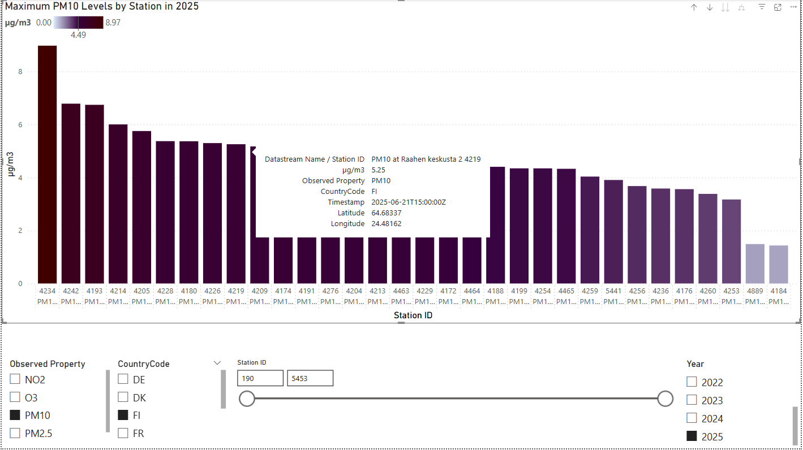

# 📊 Power BI Projects

This repository contains a collection of data visualization projects built using **Power BI**. Each project explores a specific dataset and presents insights through interactive dashboards, backed by light data processing where needed (e.g., Python scripts, Azure pipelines).

> 🎯 These are practical, insight-focused dashboards designed to demonstrate real-world skills in data modeling, visualization, and communication.

---

## 🚀 Projects

### 🔸 **Air Quality Dashboard**

Visualizes air pollutant levels such as **PM2.5**  **PM10** collected from environmental sensor networks over time.

- Interactive filters: pollutant type, country, year, station range
- Tooltip-enhanced station comparisons
- Dynamic titles and data-driven styling
- Built from open environmental data using the **SensorThings API**, accessed via a custom Python script

📍 Technologies:
`Power BI`, `Python`, `Azure`, `SensorThings API`

👉 [View the project folder](./airQuality)

---

## 🧠 About These Projects

Each project here is designed to:
- Analyze a real or realistic dataset
- Tell a clear visual story through Power BI
- Demonstrate practical data skills beyond dragging visuals

Whether you're exploring IoT sensor data, public datasets, or custom pipelines, this repo grows as I explore new domains and tools.

---

## 📌 More Coming Soon
Expect additions like:
- Weather trends analysis
- Real-time sensor mockups via Azure Edge + Power BI

---

## 💬 Questions or Feedback?
Feel free to open an issue or drop feedback. This repo is active, evolving, and part of my portfolio to document growth in analytics, cloud, and storytelling through data.
